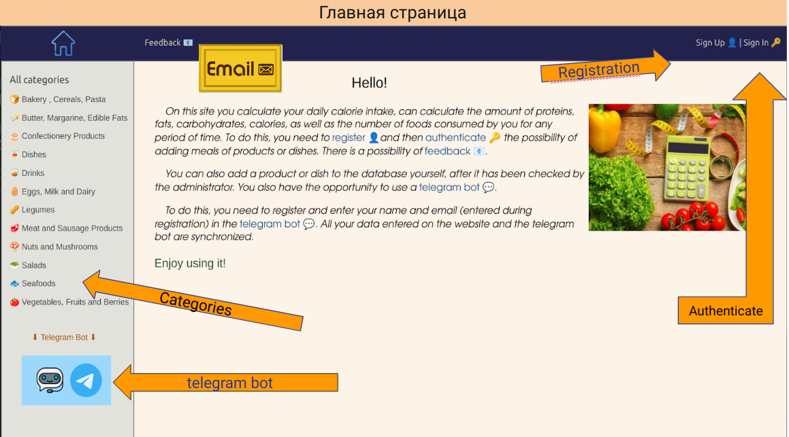
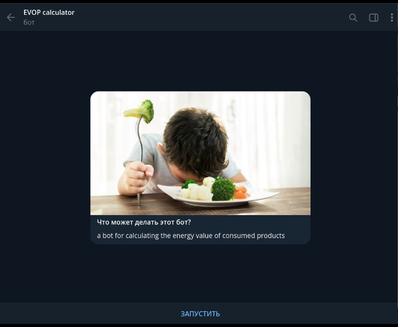
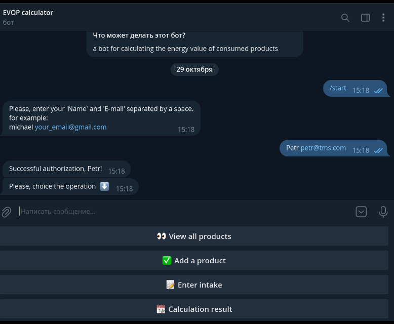

<p align="center"></p>

### *Вот всего лишь несколько скриншотов из презентации:*

<p align="center"></p>
<p align="center"></p>
<p align="center"></p>

## 👀 Вы можете посмотреть полностью презентацию для визуального ознакомления с проектом, открыв файл presentation.pptx 🌇 <br> или пройдя по ссылке https://docs.google.com/presentation/d/1zWeUILajUYVpCl6ghaZwvIreD2uL1lb04hoLQyn2yrM/edit?usp=sharing

## <p style="color: #2aabd2"> В проекте EVOP(energy values of products) реализовано:

    • веб-приложение EVOP(Django Framework)
    • API приложение EVOP(Django Rest Framework)
    • БД (postgreSQL)
    • встроенная админка
    • регистрация-авторизация (basicAuth, cookieAuth,jwtAuth,tokenAuth)
    • обратная связь(e-mail)
    • автоматическое отправление e-mail администратору для проверки корректности данных при 
    добавлении нового продукта в бд как из веб-приложения так и из telegram-bot
    • Celery (во время отправки писем администратору), Celery Beat(обновление базы данных), Redis 
    • captcha(math.challenge)
    • автоматическая документация API Django Rest Framework с помощью DRF Spectacular
    • возможность парсить продукты, блюда и их энергетические ценности с одного или нескольких сайтов
    и складывать данные в общую базу данных.
    • кэширование наиболее часто используемыx страниц приложения
    • пагинация
    • telegram-bot (telebot, psycopg2, smtplib)

## <p style="color: burlywood">Основной функционал:

### *Любой пользователь может:*

    • просмотреть главную страницу сайта, где можно узнать возможности приложения 
    • возможность отправить письмо администратору(e-mail), предварительно введя верно проверочный
    (математический) код(captcha)
    • просмотреть все продукты(около 1400 наименований) и их значения  БЖУ в базе 
    данных(и по категориям)
    • зарегистрироваться 
    • авторизоваться

### *Авторизованный пользователь также может:*

    • добавить продукт в базу данных(высылается письмо на почту администратора и только после
    проверки данных продуктдобавляется )
    • добавлять свои приемы пищи
    • рассчитать индивидуальную суточную норму ККАЛ по личным параметрам пользователя(пол, рост,
    вес,возраст, активность)
    • просматривать количество ККАЛ и БЖУ которые он употребил за любой (введенный) промежуток 
    времени в днях
    • пользоваться telegram-ботом для просмотра всех продуктов по категориям(для удобства),
    добавления продуктов(автоматическое отправление e-mail администратору),расчета  ККАЛ и БЖУ 
    которые он употребил за любой (введенный) промежуток времени в днях.
    (Единая  база данных c веб-приложением)

<p style="color: cyan; font-size: large ">Это инструкция для запуска проекта на вашем локальном компьютере:

<a style="color: #b9f7b9"> Всего лишь 5 шагов 😉❗:</a>

<p style="color: khaki">1. Создайте либо перейдите в директорию проекта. Для создания директории:</p>

```sh
$ mkdir your_project_dir
```

<p style="color: khaki">2. Перейдите в вашу директорию:</p>

```sh
$ cd path/to/your_project_dir
```

<p style="color: khaki">3. Клонируйте репозиторий:</p>

```sh
$ git clone https://github.com/DmitryMarhalik/Py88_diplom_marhalik__energy_values.git .
``` 

👆 Если вы не используете Git, то вы можете просто скачать исходный код репозитория в ZIP-архиве<br>
и распаковать его на свой компьютер 🖥
<p style="color: khaki">4. Создайте виртуальное окружение и активируйте его:</p>

```sh
$ python3 -m venv yourvenv 
$ source yourvenv/bin/activate
```

<p style="color: khaki">5. Затем установите зависимости:</p>

```sh
(yourvenv)$ pip install -r requirements.txt
```

Обратите внимание на <a style="color: khaki">(yourvenv)</a> перед приглашением. Это указывает на то, что данный<br>
терминальный сеанс работает в виртуальной среде.

Как только pip завершит загрузку зависимостей:

```sh
(yourvenv)$ python manage.py runserver
```

<p style="color: khaki">6. Последним шагом запустите telegram-bot 👇:</p>

```sh
(yourvenv)$ python telegram_bot/bot.py
```

**возможно Вам нужно будет установить redis-server:*

```sh
(yourvenv)$ sudo apt-get install redis-server
```

➡ И перейдите к http://127.0.0.1:8000/

Enjoy using it!

<p>🌐 https://www.linkedin.com/in/dmitry-marhalik/</p>